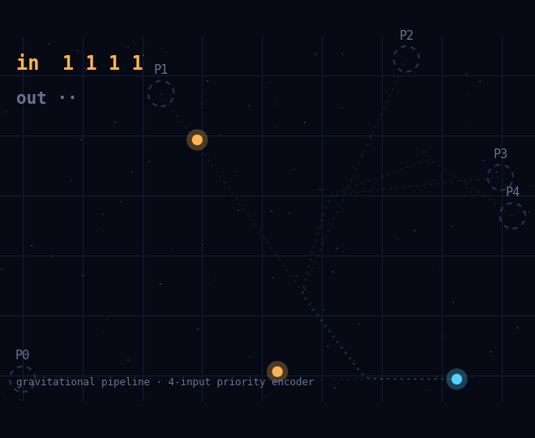
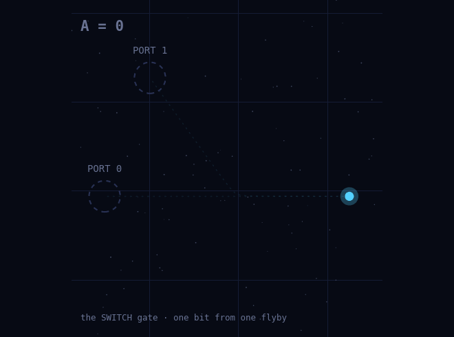
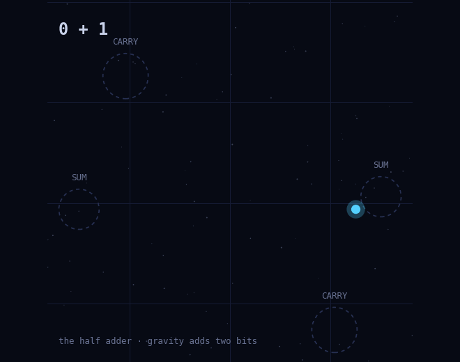
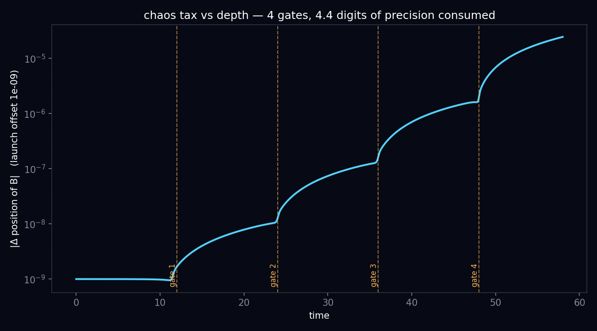

# Slingshot Computing

**Logic gates, arithmetic, and a programmable pipeline built from nothing but Newtonian point-mass gravity.**

Bits are the presence or absence of small bodies on ballistic trajectories; gates
are close hyperbolic flybys that deflect them between output ports — the
gravitational analogue of the Fredkin–Toffoli billiard-ball computer, with elastic
collisions replaced by two-body Kepler scattering. No forces but `F = Gm₁m₂/r²`.

<p align="center">
  
</p>

<p align="center"><em>The flagship: one ball threads four gravitational gates. Its exit port is the index of the first absent control — a 4-input priority encoder, computed by gravity alone.</em></p>

---

## What's here

| | Demo | What gravity computes |
|---|---|---|
| **01** | [SWITCH gate](#01--the-switch-gate) | one bit: a flyby routes a ball between two ports |
| **02** | [Arithmetic](#02--gravity-does-arithmetic) | a half adder (`1+1=10`) and a composed AND |
| **03** | [The pipeline](#03--the-4-gate-pipeline-flagship) | a 4-input priority encoder + 4-input AND, in one 5-body machine |

All three run as self-contained Python and render as animated HTML viewers
(`python3 -m demos.build_viewer`). Everything is verified by the test suite
(physics invariants, every truth table, error paths, demo contracts).

---

## 01 · The SWITCH gate

<p align="center">
  
</p>

Ball **B** (the signal) always flies. Bit **A** is whether ball A is launched.

- **A absent** → B flies straight → **port 0**
- **A present** → mutual gravitational deflection (impact parameter `b=1`, relative
  speed `v=2`, so `tan(θ/2) = G(m_A+m_B)/(b·v²) = 0.5` → `θ ≈ 53°`) → **port 1**

A switch plus routing is universal-adjacent: it gives AND / OR / NOT the same way
the billiard-ball model does.

## 02 · Gravity does arithmetic

<p align="center">
  
</p>

`slingshot/circuits.py` composes two circuits on the primitive:

- **Half adder** — the flyby *is* Fredkin–Toffoli's interaction gate: with both balls
  as input bits, deflected exits = **CARRY** (`A∧B`), straight exits = **SUM** (`A⊕B`).
  All four cases verified — `1+1=10`.
- **Gate cascade** — B always flies; bit A gates flyby 1, bit C is a third ball aimed
  at B's *post-gate-1* trajectory. B ends double-bent iff `A∧C`. Composition is the
  step that turns ballistic scattering into a *computer*.

Two lessons the cascade forced, both measured:

- **No shielding** — C's long-range pull drags B off course during the whole
  approach; the naive billiard aim collapses the impact parameter from 1.0 to 0.1.
  Wires must be calibrated on the full three-body problem.
- **No insulation** — deflection falls off only as `~1/b`, so idle lanes bend each
  other (7° crosstalk). Gates must be spaced until logic lanes diverge — routing is
  part of the physics.

**The chaos tax, measured:** a `1e-8` launch offset grows ×6 through gate 1 and ×17
through gate 2 — ~1 digit of precision per gate, with no restoring force.

## 03 · The 4-gate pipeline (flagship)

`slingshot/pipeline.py` compiles a **5-body machine**: one signal ball threads
**four gravitational gates in series**. Each present control bends B one 54°
port-step deeper, so B's exit port = **index of the first absent control** — a
**4-input priority encoder** — and all-present is a **4-input AND** at the deepest
port. All 16 inputs verified; worst decision margin measured 15.4° against the 27°
boundary (tests enforce < 20°); energy drift on the deep run `1.3e-12` (tests
enforce < 1e-9).

**The compiler is the interesting part.** The five bodies form one coupled system
(no gravitational shielding), so gates can't be calibrated independently — naive
per-gate loops limit-cycle. It's solved as a **boundary-value problem**: a greedy
seed, then Levenberg–Marquardt over per-gate (timing, impact-parameter) knobs with a
**local per-gate bend residual** — a cumulative target lets adjacent gates split a
port (the exact 27° = BEND/2 trap); the local target forbids it.

**The depth wall — a result, not a bug.** Four gates is the ceiling. A 5th control
would fly ~60 units through the whole accumulated field, get chaotically deflected,
and can't be aimed onto B — its calibration Jacobian goes flat. Gates 1–4 compile
every time; gate 5 never lands. **Chaos bounds computational *depth*, not just
precision** — and the two limits are separable: the measured chaos tax (~1.1
digits/gate, 4.4 across the chain) would allow ~13 gates on float64, so *aiming*,
not precision, is the binding limit — the wall arrives at the 5th gate.

<p align="center">
  
</p>

---

## Run it

```bash
python3 -m pip install -r requirements.txt

python3 -m demos.switch_demo        # 01: SWITCH gate
python3 -m demos.arithmetic_demo    # 02: half adder + cascade + chaos tax
python3 -m demos.pipeline_demo      # 03: 4-gate priority encoder + AND (flagship)

python3 -m demos.build_viewer       # build the interactive out/*.html viewers
python3 -m demos.make_gifs          # re-render docs/*.gif
python3 -m pytest                   # full test suite (74 tests)
```

Each demo prints its truth table and measurements and writes plots + trajectory
JSON to `out/`. The pipeline spec is cached in `out/pipeline_spec.json`
(compilation takes a few minutes; delete it to recompile).

## Physics & numerics

- Pure pairwise Newtonian gravity, `G = 1`, planar, **no softening** — softening
  would smear out the sharp scattering the gates depend on.
- Adaptive high-order Runge–Kutta (scipy `DOP853`, `rtol = atol = 1e-12`); energy
  drift ranges `1e-13` (single-gate demos) to `1e-12` (the 4-gate pipeline).
  Calibration relaxes tolerance for speed, then validates the finished machine
  at full precision.

## Layout

```
slingshot/     nbody.py (integrator) · gates.py · circuits.py · pipeline.py (compiler)
demos/         one runnable script + HTML viewer per demo, plus make_gifs.py
tests/         physics invariants, truth tables, error paths, demo contracts (74 tests)
docs/          the GIFs above
```

## Honest caveats & prior art

- Turing-completeness here holds only in the exact-real idealization: n-body chaos
  consumes ~constant digits of precision per gate, and gravity has no attractor
  states, so there is no error correction. That decay is a *feature* of the project
  — measured, not hidden.
- Nearest prior art: Fredkin & Toffoli's billiard-ball computer (1982), Moore's
  Turing-machine embeddings in smooth dynamics (1990), Cardona–Miranda–Peralta-Salas–
  Presas on Turing-complete Euler flows (2021), Tao's universality-of-dynamics
  program. Gravitational-slingshot gates as a *built* artifact appear to be unclaimed
  territory.

## Roadmap

- [x] SWITCH gate (one flyby, two ports)
- [x] AND gate (cascade: two flybys composed in series)
- [x] Half adder (interaction gate + detector regions)
- [x] Measure bits-of-precision consumed per gate
- [x] Circuit compiler: N gates auto-placed and calibrated (boundary-value solve)
- [x] 4-gate pipeline: priority encoder + 4-input AND, 16 cases
- [x] Found the depth wall (~4 gates) set by chaotic control-flight
- [ ] Heavy near-ballistic "mirror" controls to push depth past 4
- [ ] Dual-rail encoding so absence-of-ball isn't the only "0"
- [ ] Fan-out / signal copying (the hard one: no cloning in reversible ballistics)
